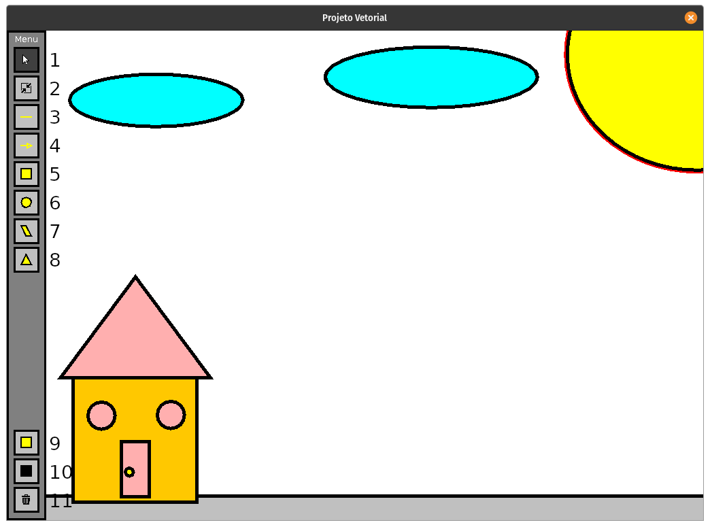

# Projeto 2

Segundo projeto de LP2.
- **1** - Ferramenta de seleção e movimentação.
- **2** - Ferramenta de redimensionamento de figura (clicando nas bordas e arrastando). Também é possível movimentar a figura nesta ferramenta.
- **3** - Criar linha.
- **4** - Criar seta.
- **5** - Criar retângulo.
- **6** - Criar elipse.
- **7** - Criar paralelogramo.
- **8** - Criar triângulo.
- **9** - Alterar cor do plano de fundo do objeto selecionado.
- **10** - Alterar cor do contorno do objeto selecionado.
- **11** - Excluir objeto selecionado.
## Comandos do Teclado
### Criar Figuras ###
- **Q** - Criar Linha
- **W** - Criar Seta
- **E** - Criar Elipse
- **R** - Criar Retângulo
- **T** - Criar Triângulo
- **Y** - Criar Paralelogramo

### Modificação da Figura Selecionada ###
- **S** - Spin, rotaciona a figura para a direita, em torno do seu próprio eixo.
- **Shift + S** - Spin, rotaciona a figura para a esquerda, em torno do seu próprio eixo.
- **C** - Muda a cor da figura aleatoriamente.
- **Ctrl + C** - Muda a cor do contorno aleatoriamente.
- **Roda do Mouse** - Aumentar/Diminuir tamanho da figura.
- **Ctrl + Roda do Mouse** - Aumentar/Diminuir tamanho do contorno.
- **Sift + Roda do Mouse** - Aumentar/Diminuir altura da figura.
- **Alt + Roda do Mouse** - Aumentar/Diminuir largura da figura.
- **DELETE** - Excluir figura.

## Funcionalidades
- Criar, excluir, movimentar, redimensionar, rotacionar e modificar cores de figuras.
- Salvar projeto em um arquivo binário ao sair do programa.
- Salvar projeto em um arquivo vetorial SVG ao sair do programa. Podendo, inclusive, ser editados em programas externos, como o Inkscape.
- Carregar automaticamente o último projeto em aberto ao iniciar o programa (arquivo binário).

## Como Executar
O programa depende da biblioteca JFreeSVG para gerar os arquivos SVG, assim sendo, é necessário adicionar o arquivo org.jfree.svg.jar ao compilar e executar o programa. 
Uma forma de fazer isso é alterando o classpath, por exemplo, para compilar:
```bash
javac App.java -classpath org.jfree.svg.jar:.
```
Outra forma é utilizando o cp, por exemplo, para executar o programa:
```bash
java -cp org.jfree.svg.jar:. App
```
Os comandos acima assume que você está em um sistema Unix-like e no diretório do arquivo App.java. Para execução em ambientes Windows pode ser necessário substituir os ```:``` por ```;```.
## Licença e Referências
Considere todo o código contido neste repositório licenciado em **LGPL-2.1**. Veja os detalhes da licença clicando [aqui](https://github.com/FaelLiberatori/LP2/blob/main/LICENSE).
### Arquivos de Terceiros
- **JFreeSVG** por Object Refinery Limited. Licenciado em [GPL-3.0](https://github.com/jfree/jfreesvg/blob/master/LICENSE). Disponível em: https://github.com/jfree/jfreesvg
- **Icone de mouse** por qubodup. Licenciado em Creative Commons. Disponível em: https://openclipart.org/detail/222077/rpg-curved-mouse-cursor
- **Icone de lixeira** por Creative Stall. Licenciado em Creative Commons. Disponível em: https://thenounproject.com/term/garbage-bin/629051/
- **Icone de redimensionar** por Vaadin. Licenciado em Creative Commons. Disponível em: https://iconscout.com/icon/compress-32
